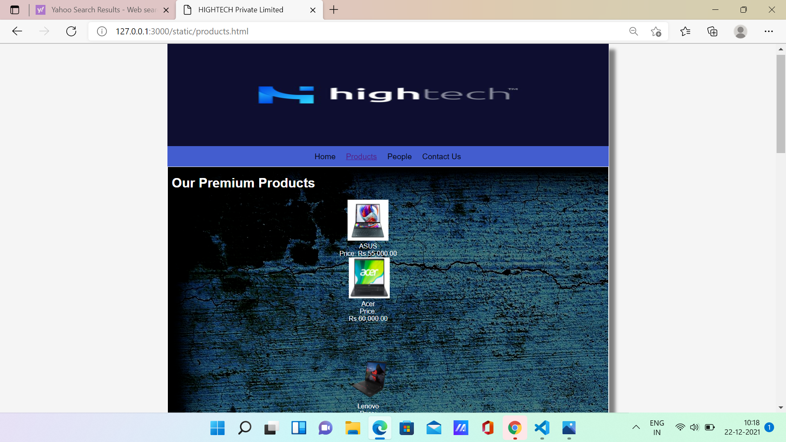
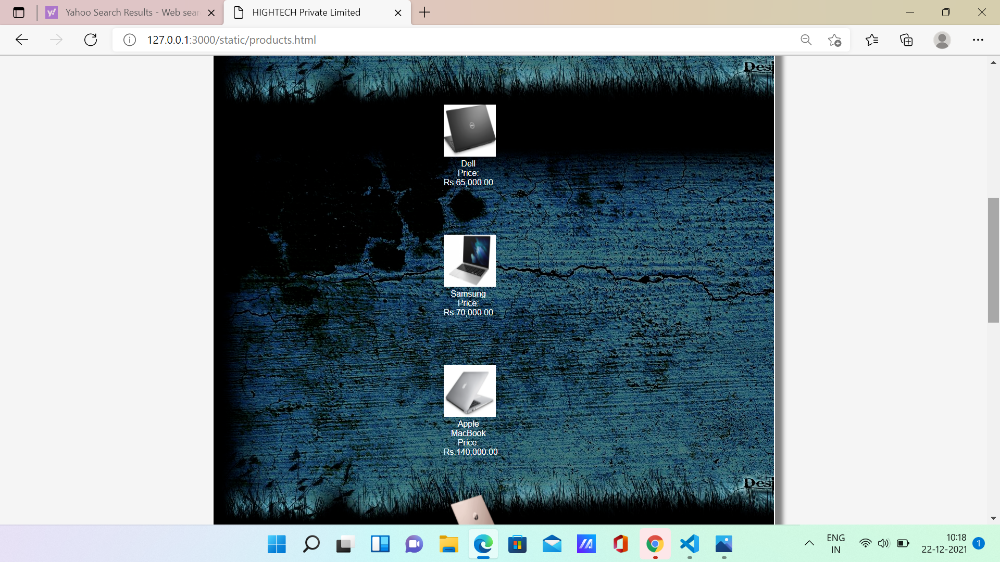
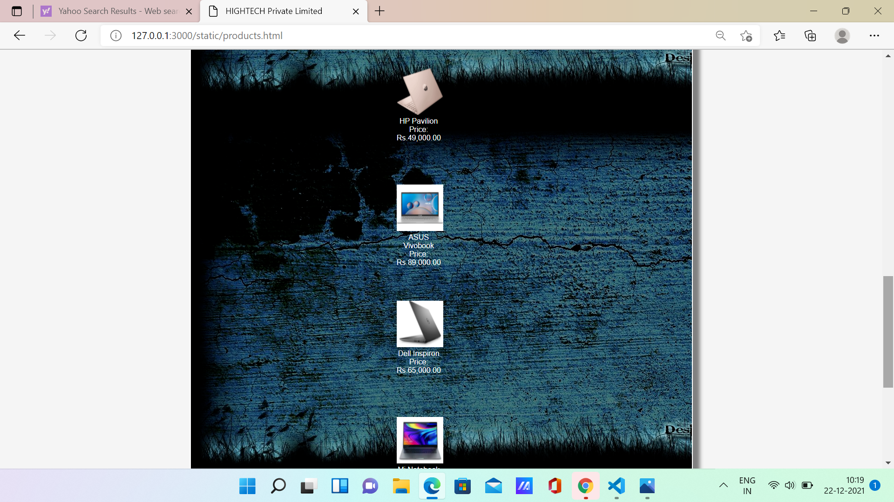
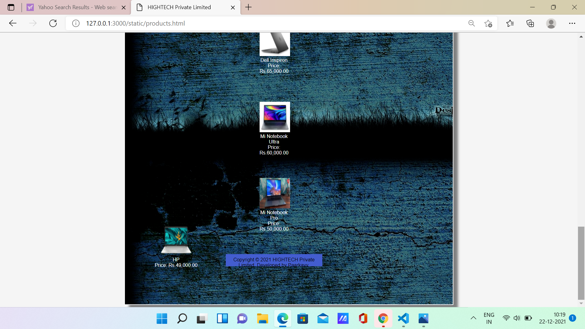

# Web Design for a Software Product Company

## AIM:

To design a static website for a software product company company.

## DESIGN STEPS:

### Step 1:

Requirement collection.

### Step 2:

Creating the layout using HTML and CSS.

### Step 3:

Updating the sample content.

### Step 4:

Choose the appropriate style and color scheme.

### Step 5:

Validate the layout in various browsers.

### Step 6:

Validate the HTML code.

### Step 6:

Publish the website in the given URL.

## PROGRAM :
Layout.css
```
* {
  box-sizing: border-box;
  font-family: Arial, Helvetica, sans-serif;
}
body {
  background-color: whitesmoke;
  color: #17421d;
}
.container {
  width: 1080px;
  margin-left: auto;
  margin-right: auto;
  border-width: 1px 1px 1px 1px;
  border-style: solid;
  box-shadow: 15px 15px 8px gray;
}

.banner {
  display: block;
  width: 100%;
  height: 250px;
  text-align: center;
  font-size: 60px;
  background-image: url("/static/img/HIGHTECH LOGO.jpg");
  background-size: 100% 100%;
  margin: 0px 0px 0px 0px;
  padding-top: 150px;
  color: #2773e6;
}

.menu {
  display: block;
  width: 100%;
  height: 50px;
  font-size: larger;
  background-color: rgb(26, 81, 143);
  text-align: center;
  padding-top: 15px;
  margin: 0px 0px 0px 0px;
  border-width: 1px;
}

.menuitem {
  display: inline-block;
  margin-left: 10px;
  margin-right: 10px;
}
.menuitemselected {
  display: inline-block;
  margin-left: 10px;
  margin-right: 10px;
  color: #16d1ae;
}

.menuitem a {
  text-decoration: none;
  color: #131212;
}

.content {
  display: block;
  width: 100%;
  background-image: url("/static/img/background3.png");
  min-height: 500px;
  background-size: 100% 100%;
  margin: 0px 0px 0px 0px;
  border-width: 1px;
  border-color: white;
  border-style: solid;
}
.homecontent {
  min-height: 500px;
  margin: 10px 10px 10px 10px;
  color: black;
  display: inline;
}
.homecontent h1 {
  color: rgb(248, 242, 242);
  display: inline;
  text-align: left;
}
.homecontent img {
  float: right;
  width: 400px;
  height: 300px;
  margin-left: 10px;
}

.contenttext {
  text-align: justify;
  color: rgb(255, 255, 255);
}

.productcontent {
  min-height: 500px;
  margin: 10px 10px 10px 10px;
}

.productcontent h1 {
  display: inline;
  color: rgb(253, 251, 251);
  text-align: left;
}

.productitems {
  display: block;
}

.productitem {
  display: inline-block;
  width: 30%;
  height: 250px;
  text-align: center;
}

.productitem img {
  width: 100px;
  height: 100px;
  display: inline-block;
}
.productitem .itemimage {
  display: inline-block;
  margin-left: auto;
  margin-right: auto;
  width: 100px;
  margin-bottom: 5px;
}

.productitem .itemname {
  display: block;
  color: rgb(253, 249, 249);
  font-family: block;
}
.productitem .itemprice {
  display: block;
  color: rgb(255, 255, 255);
  font-family: block;
}

.footer {
  display: block;
  width: 100%;
  height: 40px;
  background-color: rgb(27, 87, 216);
  text-align: center;
  padding-top: 10px;
  margin: 0px 0px 0px 0px;
  color: #0f0f0f;
}

.productitem1 .itemimage1 {
  display: inline-block;
  margin-left: auto;
  margin-right: auto;
  width: 100px;
  height: 40px;
  margin-bottom: 5px;
}

.productitem1 .itemprice1 {
  display: block;
  color: rgb(255, 255, 255);
  font-family: block;
}
```
HOME PAGE
```
<!DOCTYPE html>
<html lang="en">
  <head>
    <title>HIGHTECH Private Limited</title>
    <link rel="stylesheet" href="./css/layout.css" />
    <link rel="icon" href="./img/icon.png" type="image/x-icon" />
  </head>

  <body>
    <div class="container">
      <div class="banner"></div>
      <div class="menu">
        <div class="menuitemselected"><a href="/static/home.html">Home</a></div>
        <div class="menuitem"><a href="/static/products.html">Products</a></div>
        <div class="menuitem"><a href="/static/people.html">People</a></div>
        <div class="menuitem"><a href="/static/contactus.html">Contact Us</a></div>
      </div>
      <div class="content">
        <div class="homecontent">
          <h1>About Us</h1>
          
          <div class="contenttext">
            A laptop, laptop computer, or notebook computer is a small, portable personal computer (PC) 
           with a screen and alphanumeric keyboard. These typically have a clam shell form factor with 
           the screen mounted on the inside of the upper lid and the keyboard on the inside of the lower lid, 
           although 2-in-1 PCs with a detachable keyboard are often marketed as laptops or as having a 
           laptop mode. Laptops are folded shut for transportation, and thus are suitable for mobile use.[1] 
           Its name comes from lap, as it was deemed practical to be placed on a person's lap when being used. 
           Today, laptops are used in a variety of settings,
           such as at work, in education, for playing games, web browsing, for personal multimedia, and general home computer use.

            <br />
            As of 2021, in American English, the terms 'laptop computer' and 'notebook computer' are used
           interchangeably;[2] in other dialects of English one or the other may be preferred.
           Although the terms 'notebook computers' or 'notebooks' originally referred to a specific size
           of laptop (originally smaller and lighter than mainstream laptops of the time),[3] the terms 
           have come to mean the same thing and notebook no longer refers to any specific size
            <ul>
              <li>Budget Friendly</li>
              <li>Easy to carry</li>
              <li>Anywhere, anytime and secure access</li>
            </ul>
          </div>
        </div>
      </div>
      <div class="footer">
        Copyright &#169; 2021 HIGHTECH Private Limited, Developed by Paarkavy
      </div>
    </div>
  </body>
</html>
```
PRODUCT PAGE
```
<!DOCTYPE html>
<html lang="en">
  <head>
    <title>HIGHTECH Private  Limited</title>
    <link rel="stylesheet" href="./css/layout.css" />
    <link rel="icon" href="./img/icon.png" type="image/x-icon" />
  </head>

  <body>
    <div class="container">
      <div class="banner"></div>
      <div class="menu">
        <div class="menuitem"><a href="/static/home.html">Home</a></div>
        <div class="menuitemselected">
          <a href="/static/products.html">Products</a>
        </div>
        <div class="menuitem"><a href="/static/people.html">People</a></div>
        <div class="menuitem"><a href="/static/contactus.html">Contact Us</a></div>
      </div>
      <div class="content">
        <div class="productcontent">    
          <h1>Our Premium Products</h1>
          <div class="productitems">
              <div class="productitem"> 
                  <div class="itemimage">
                  
                  </div>
                  <div class="itemname">Acer</div>
                  <div class="itemprice">Price: Rs.59,999/- </div>
              </div>
              <div class="productitem"> 
                  <div class="itemimage">
                  
                  </div>
                  <div class="itemname">Apple Macbook</div>
                  <div class="itemprice">Price: Rs.1,75,000/- </div>
              </div>
              <div class="productitem"> 
                <div class="itemimage">
                
                </div>
                <div class="itemname">ASUS</div>
                <div class="itemprice">Price: Rs.70,000/- </div>
              </div>
              <div class="productitem"> 
                <div class="itemimage">
                
                </div>
                <div class="itemname">Asus Vivobook</div>
                <div class="itemprice">Price: Rs.69,999/- </div>
            </div>
            <div class="productitem"> 
              <div class="itemimage">
              
              </div>
              <div class="itemname">Dell</div>
              <div class="itemprice">Price: Rs.65,000/- </div>
          </div>  <div class="productitem"> 
            <div class="itemimage">
            
            </div>
            <div class="itemname">Dell Inspiron</div>
            <div class="itemprice">Price: Rs.79,999/- </div>
        </div>
        <div class="productitem"> 
        <div class="itemimage1">
          
          </div>
          <div class="itemname">HP</div>
          <div class="itemprice">Price: Rs.89,999/- </div>
      </div>
      <div class="productitem"> 
        <div class="itemimage1">
          
          </div>
          <div class="itemname">HP Pavilion</div>
          <div class="itemprice">Price: Rs.99,000/- </div>
      </div>
      <div class="productitem"> 
        <div class="itemimage1">
          
          </div>
          <div class="itemname">Lenovo</div>
          <div class="itemprice">Price: Rs.49,000/- </div>
      </div>
      <div class="productitem"> 
        <div class="itemimage1">
          
          </div>
          <div class="itemname">Mi Notebook Ultra</div>
          <div class="itemprice">Price: Rs.69,990/- </div>
      </div>
      <div class="productitem"> 
        <div class="itemimage1">
          
          </div>
          <div class="itemname">Mi Notebook Pro</div>
          <div class="itemprice">Price: Rs.80,000/- </div>
      </div>      <div class="productitem"> 
        <div class="itemimage1">
          
          </div>
          <div class="itemname">Samsung</div>
          <div class="itemprice">Price: Rs.75,000/-</div>
      </div>
            </div>
          </div>
          </div>  
          </div>>      
      </div>
      <div class="footer">
        Copyright &#169; 2021  HIGHTECH Private Limited, Developed by Paarkavy.B
      </div>
    </div>
  </body>
</html>
```
PEOPLE PAGE
```
<!DOCTYPE html>
<html lang="en">
  <head>
    <title>HIGHTECH Private Limited</title>
    <link rel="stylesheet" href="./css/layout.css" />
    <link rel="icon" href="./img/ail.png" type="image/x-icon" />
    </head>
    <body>
    <div class="container">
      <div class="banner"></div>
      <div class="menu">
        <div class="menuitem"><a href="/static/home.html">Home</a></div>
        <div class="menuitem"><a href="/static/products.html">Products</a></div>
        <div class="menuitemselected"><a href="/static/people.html">People</a></div>
        <div class="menuitem"><a href="/static/contactus.html">Contact Us</a></div>
        </div>
      <div class="content">
        <div class="homecontent">
          <h1>Our company employees:</h1><br><br>
          <div class="productitems">
            <div class="productitem"> 
                <div class="itemimage">
                
                </div>
                <div class="itemname">Sanjay</div>
                <div class="itemprice">Principal Engineer</div>
            </div>
            <div class="productitem"> 
                <div class="itemimage">
                
                </div>
                <div class="itemname">Jeeva</div>
                <div class="itemprice">Senior Engineer</div>
            </div>
            <div class="productitem"> 
              <div class="itemimage">
              
              </div>
              <div class="itemname">Dev</div>
              <div class="itemprice">Junior Engineer </div>
            </div>
            <div class="productitem"> 
              <div class="itemimage">
              
              </div>
              <div class="itemname">Bharat</div>
              <div class="itemprice">Service Engineer</div>
          </div>
          <div class="productitem"> 
            <div class="itemimage">
            
            </div>
            <div class="itemname">Ajay</div>
            <div class="itemprice">Sales Executive</div>
        </div>  <div class="productitem"> 
          <div class="itemimage">
          
          </div>
          <div class="itemname">Ezhil</div>
          <div class="itemprice">Technician</div>
      </div>
          </div>
        </div>
        </div>        
    </div>
    <div class="footer">
      Copyright &#169; 2021 HIGHTECH Private Limited, Developed by Paarkavy
    </div>
  </div>
</body>
</html>
```
CONTACTUS
```
<!DOCTYPE html>
<html lang="en">
  <head>
    <title>HIGHTECH Privated Limited</title>
    <link rel="stylesheet" href="./css/layout.css" />
    <link rel="icon" href="./img/ail.png" type="image/x-icon" />
  </head>

  <body>
    <div class="container">
      <div class="banner"></div>
      <div class="menu">
        <div class="menuitem"><a href="/static/home.html">Home</a></div>
        <div class="menuitem"><a href="/static/products.html">Products</a></div>
        <div class="menuitem"><a href="/static/people.html">People</a></div>
        <div class="menuitemselected"><a href="/static/contactus.html">Contact Us</a></div>
      </div>
      <div class="content">
        <div class="homecontent">
          <h1>Contact Us:</h1>
          <h1>Address:</h1>
          <div class="contenttext">
            27/3, NEHRU COLONY,  MUMBAI, 256483, INDIA.
        </div><br>
        <h1>Phone:</h1><br>
        <div class="contenttext">
            Ms.Divya(HR):8746584536<br><br>
            Ms.Preethi(Assistant HR):9365476534
        </div>
          <h1>E-Mail:</h1>
          <div class="contenttext">
              Sales:hightech001@gmail.com
          </div>
        </div>
      </div>
      <div class="footer">
        Copyright &#169; 2021 HIGHTECH Private Limited, Developed by Paarkavy
      </div>
    </div>
  </body>
</html>
```

## OUTPUT:

### PRODUCT PAGE:

### PRODUCT PAGE:

### PEOPLE PAGE:

### Contact us  PAGE:


## Result:

Thus a website is designed for the software product company and the HTML,CSS code are validated.
